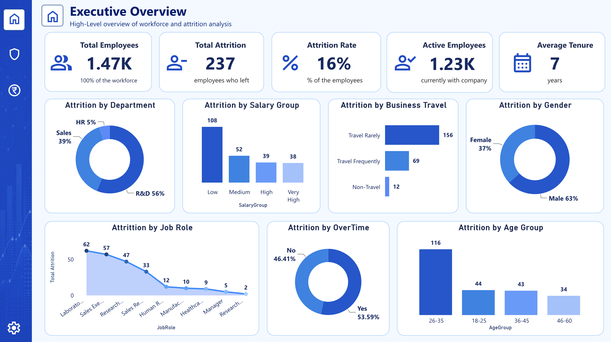
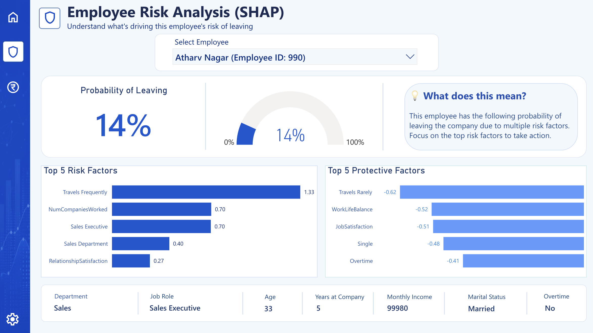
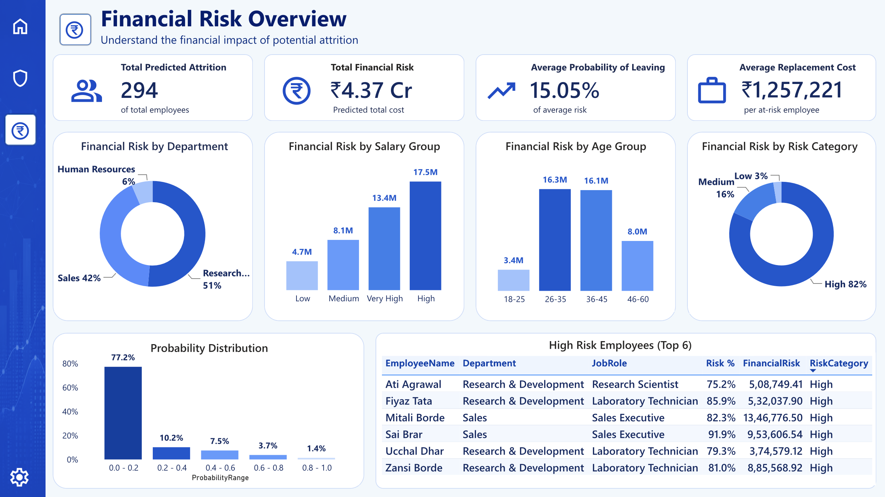
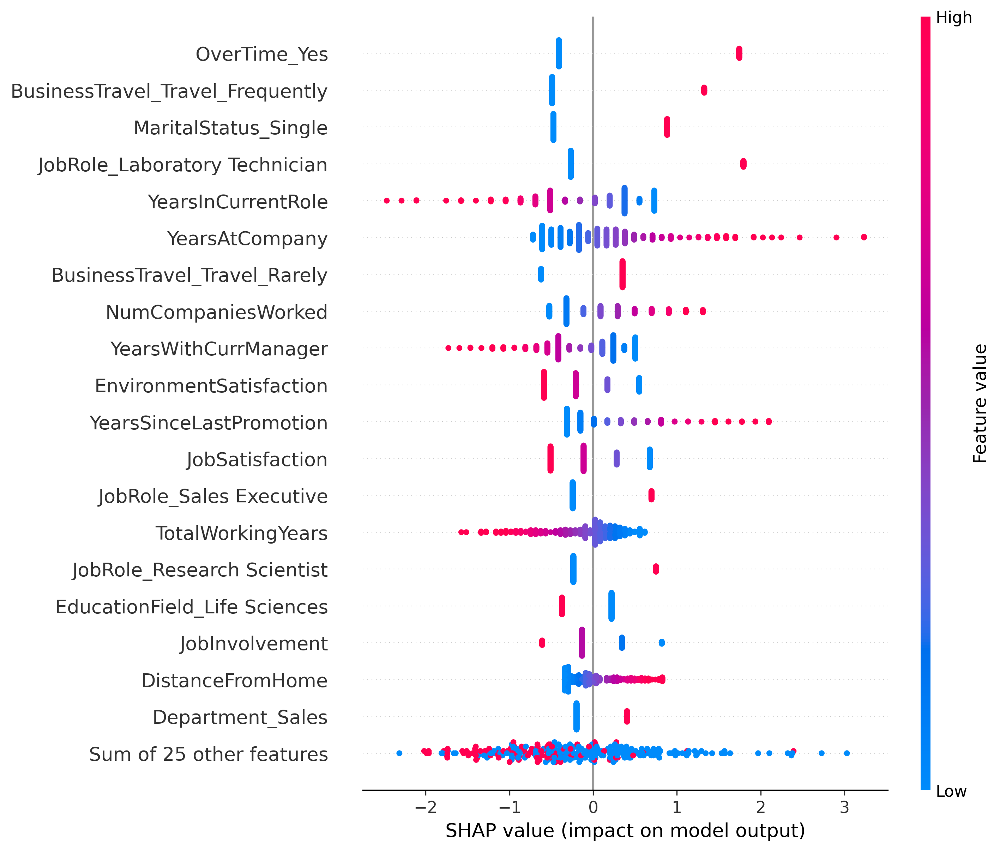
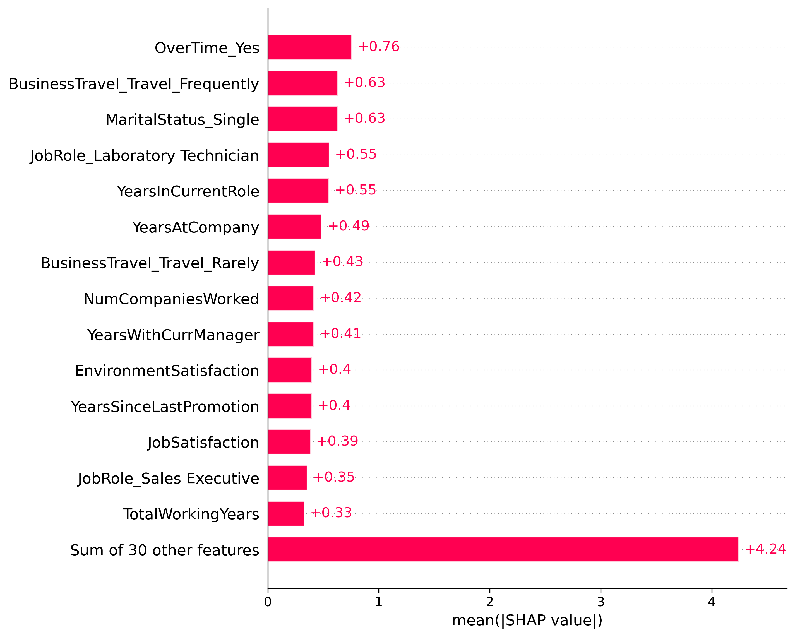

# Employee Risk Analytics
### Explainable Employee Attrition & Financial Risk Prediction System using Logistic Regression, SHAP & Power BI

<p align="center">
  
</p>

---

## Project Overview

Employee attrition is one of the most significant challenges organizations face, leading to increased recruitment costs, productivity loss, and disruption of business operations.

This project presents an end-to-end HR Analytics solution that predicts employee attrition, explains the factors influencing each prediction using Explainable AI (SHAP), estimates the financial impact of potential employee turnover, and visualizes actionable insights through an interactive Power BI dashboard.

Rather than functioning as a black-box prediction model, the system provides transparent, employee-level explanations to support informed HR decision-making.

---

## Key Features

- Predicts employee attrition using Logistic Regression
- Explains every prediction using SHAP (Explainable AI)
- Estimates financial risk associated with employee turnover
- Interactive Power BI dashboard for executives and HR managers
- Employee-level risk analysis with top positive and negative contributing factors
- End-to-end data science workflow from preprocessing to deployment-ready dashboards

---

## Project Workflow

```
IBM HR Dataset
        │
        ▼
Data Cleaning & Preprocessing
        │
        ▼
Exploratory Data Analysis
        │
        ▼
Feature Engineering
        │
        ▼
Logistic Regression Model
        │
        ▼
Model Evaluation
        │
        ▼
SHAP Explainability
        │
        ▼
Financial Risk Estimation
        │
        ▼
Power BI Dashboard
```

---

# Dashboard Preview

## Executive Overview

<p align="center">

</p>

Provides organization-level KPIs including employee count, attrition rate, department analysis, salary insights, and workforce trends.

---

## Employee Risk Analysis

<p align="center">

</p>

Allows HR managers to inspect individual employees, view predicted attrition probability, and understand the top factors influencing each prediction using SHAP values.

---

## Financial Risk Dashboard

<p align="center">

</p>

Estimates the financial impact of predicted employee attrition, enabling organizations to prioritize retention efforts based on business risk.

---

# Explainable AI (SHAP)

Unlike traditional machine learning models that only predict whether an employee is likely to leave, this project explains **why** the prediction was made.

### SHAP Beeswarm Plot

<p align="center">

</p>

Shows the overall impact of each feature across all employees.

---

### SHAP Feature Importance

<p align="center">

</p>

Ranks features based on their contribution to the model.

---

### Individual Employee Explanation

<p align="center">

</p>

Provides employee-specific explanations showing which factors increase or decrease attrition risk.

---

# Exploratory Data Analysis

The project includes detailed exploratory analysis to identify workforce trends and attrition patterns.

Examples include:

- Employee Attrition Distribution
- Department-wise Attrition
- Salary Group Analysis
- Age Group Analysis
- Overtime Analysis
- Correlation Heatmap

These visualizations are available in the `images/eda` directory.

---

# Repository Structure

```
Employee-Risk-Analytics/

├── dashboard/
│   ├── Employee_Risk_Analytics_Dashboard.pbix
│   └── Employee_Risk_Analytics_Dashboard.pdf
│
├── data/
│   ├── Employee_Attrition_Cleaned.csv
│   ├── PowerBI_Executive_Dashboard.csv
│   ├── PowerBI_Financial_Dashboard.csv
│   └── PowerBI_SHAP_Dashboard.csv
│
├── images/
│   ├── dashboards/
│   ├── eda/
│   └── shap/
│
├── notebooks/
│   ├── 01_Data_Cleaning_EDA.ipynb
│   ├── 02_Modeling_and_Evaluation.ipynb
│   └── 03_Explainability_and_Dashboard_Datasets.ipynb
│
├── results/
│
├── README.md
└── index.html
```

---

# Technologies Used

| Category | Tools |
|----------|-------|
| Programming | Python |
| Data Processing | Pandas, NumPy |
| Visualization | Matplotlib, Seaborn |
| Machine Learning | Scikit-learn |
| Explainable AI | SHAP |
| Dashboard | Power BI |
| Development | Google Colab, GitHub |

---

# Dataset

This project uses the **IBM HR Analytics Employee Attrition & Performance Dataset**, a widely used benchmark dataset for employee attrition prediction.

---

# Future Improvements

- Compare multiple machine learning algorithms (Random Forest, XGBoost, LightGBM)
- Hyperparameter optimization
- Probability calibration
- Real-time dashboard integration
- Automated retraining pipeline
- Cloud deployment

---

# Interactive Dashboard

An interactive demonstration of the Power BI dashboard is available here:

**https://ashtondsz.github.io/Employee-Risk-Analytics/**

---

# Author

**Ashton D'Souza**

Bachelor of Business Administration (Business Analytics)

Passionate about Machine Learning, Explainable AI, Data Analytics, and Business Intelligence.

---

## If you found this project useful, consider giving it a ⭐ on GitHub.
